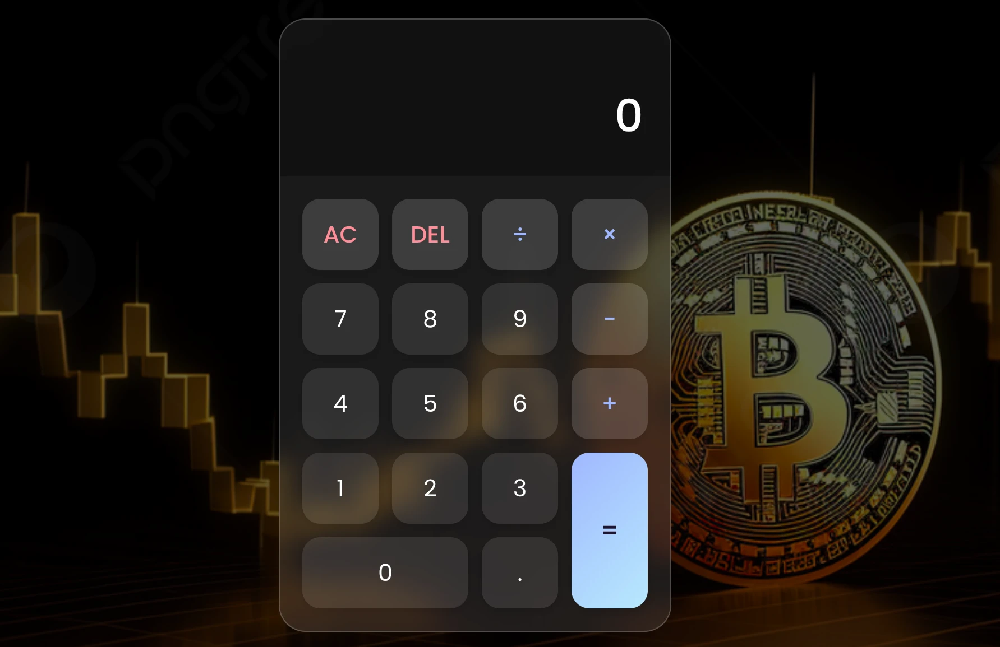

# Calculator App 🔢

A modern, responsive calculator built with HTML, CSS, and JavaScript. This project was developed as part of my Industrial Attachment at **SELISE Digital Platforms** and demonstrates clean UI design, interactive features, and production-level coding practices.



## 🚀 Live Demo

Hosted on Vercel: [Visit Calculator](https://calculator-selise-zeta.vercel.app/)

## ✨ Features

- Real-time calculation with user-friendly interface
- Responsive glassmorphism design with blurred background
- Decimal and negative number support
- Button animations for enhanced UX
- Error handling for invalid operations (e.g., division by zero)
- Smooth keyboard and mouse interactions

## 🛠️ Tech Stack

- **HTML5**
- **CSS3**
- **Vanilla JavaScript**
- **Vercel** for deployment

## 📁 Project Structure

```plaintext
calculator/
├── index.html
├── style.css
├── script.js
└── assets/
    └── bg.jpg
```
